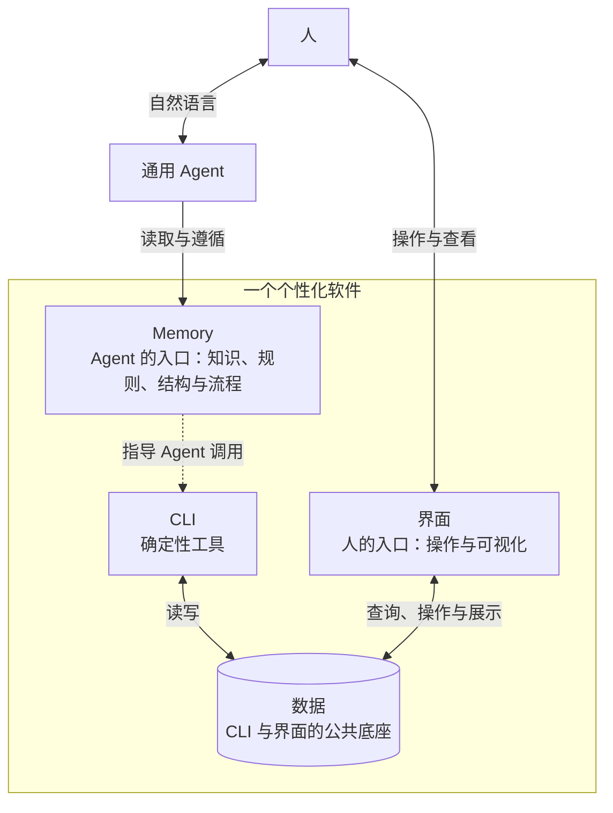

# Memsphere

简体中文 | [English](README.en.md)

> AI 时代个性化软件的运行环境

软件不再必须从代码开始。

Memsphere 让软件从自然语言开始，并在使用中逐步生长为可复用、可验证、可管理、可持续演化的个性化软件。

这里所说的个性化软件，不只面向个人。它围绕特定个人、团队、组织或行业的真实需求构建，并能随着这些需求持续演化。

Memsphere 不是另一个 Agent。它被设计为运行在不同通用 Agent 之上，为个性化软件提供一套相对稳定的语言、运行环境和资产管理方式。无论底层使用哪一种模型、哪一种 Agent，用户和组织积累下来的能力都不应被锁在一次对话或一个产品里。

## 1. 为什么会有 Memsphere

传统计算机把 CPU、GPU 等硬件能力抽象成统一的计算资源，操作系统再把这些资源组织成软件可以使用的环境。

在 AI 时代，LLM 正在成为一种新的标准算力。它擅长理解意图、处理语义、生成方案和使用工具，而使用者不必关心这些能力最终运行在 GPU、CPU、NPU 还是其他硬件上。建立在 LLM 之上的通用 Agent，则开始承担类似操作系统的角色：理解用户的目标，读取上下文，调用工具，并完成工作。

但是，有算力和 Agent 仍然不等于拥有软件。

传统软件的构建成本很高，需要专业团队把大量个体需求抽象成少数公共需求，再通过产品迭代服务尽可能多的人。那些未被抽象出来的长尾需求，通常只能依赖表格、公式、脚本和人工流程勉强解决。

LLM 改变了这种经济模型。一个人可以先用一句自然语言描述自己的工作，让 Agent 立即执行；需求发生变化时，只需修改描述；当这项工作反复出现，执行方法便可以沉淀下来。于是，软件不再必须从代码开始，它可以从自然语言开始。

问题在于，一段 Prompt 还不是可以长期依赖的软件。它通常缺少：

- 稳定的语义和规则；
- 可复用的执行流程；
- 可验证的输入、输出与中间结果；
- 持久的数据和文档；
- 确定性工具与可视化界面；
- 跨 Agent 迁移、版本管理和持续演化的机制。

Memsphere 希望补上这一层。

## 2. 从 Prompt 到 Skill，再到 Memsphere

一项个性化软件，往往从一句 Prompt 开始。它表达当前意图，让 Agent 完成一次工作。

当同类工作反复出现，执行方法可以被组织成 Skill。Skill 把指令、脚本和参考资料放在一起，使一项边界清晰的能力能够被 Agent 发现、安装和复用。[Agent Skills 开放规范](https://agentskills.io/specification)正在让这种软件形式能够在不同 Agent 之间流动。

随着需求继续生长，一项 Skill 可能需要记住长期知识、调用更多确定性工具、管理持续产生的数据、提供直接操作的界面，并记录和验证每次运行。Memsphere 为这些更丰富、更复杂的软件需求提供统一的组织方式与运行环境。

| 形态 | 适合的需求 |
| --- | --- |
| Prompt | 表达一次意图，完成当前任务 |
| Skill | 组织一项专注、边界清晰、可复用的能力 |
| Memsphere | 组织需要长期运行、持续管理和不断演化的个性化软件 |

这不是一条必须走完的路线。许多简单场景使用 Skill 已经足够，不需要变得更加复杂；当一项能力确实需要 Memory、CLI、数据和界面协同工作时，才需要由 Memsphere 承载。

Skill 与 Memsphere 也不是替代关系。在共同的 Agent 执行环境中，Skill 可以调用 Memsphere 中定义的软件，Memsphere 中的软件也可以调用 Skill 提供的能力。它们共同丰富 Agent 操作系统的软件生态。

## 3. Memsphere 位于哪里

```text
┌──────────────────────────────────────────────┐
│                 个性化软件                  │
├──────────────────────────────────────────────┤
│  Memsphere：语言、运行时与软件资产管理       │
├──────────────────────────────────────────────┤
│  通用 Agent：理解意图、规划任务、调用能力    │
├──────────────────────────────────────────────┤
│  LLM：语义计算与智能算力                     │
├──────────────────────────────────────────────┤
│  CPU / GPU / NPU / 云端及其他硬件            │
└──────────────────────────────────────────────┘
```

Agent 负责理解和执行，Memsphere 负责让软件所需的知识、规则、流程、工具、数据和界面拥有稳定的组织方式与生命周期。

这一区分很重要：Memsphere 本身不是 Agent，也不应绑定某一个 Agent。它的目标是在百花齐放的 Agent 生态中，为用户保留一层可迁移、可积累的软件资产。

## 4. 一种会生长的软件

Memsphere 规划管理四类彼此协作的资产：



四类资产在其中承担不同的责任：

| 资产 | 作用 | 演化方式 |
| --- | --- | --- |
| Memory | 作为 Agent 进入软件的入口，保存软件理解世界、作出判断和完成工作的知识、规则、结构与流程 | 从自然语言说明生长为可读取、可验证的语义模型 |
| CLI | 封装提供给 Agent 使用的确定性工具 | 从 Agent 反复执行的步骤沉淀为代码和命令 |
| 数据 | 作为 CLI 与界面的公共底座，保存软件运行中持续产生和使用的结构化数据、文件与文档集 | 从零散上下文生长为有边界、有结构、可查询的数据资产 |
| 界面 | 作为人进入软件的入口，提供操作与可视化 | 从自然语言驱动的交互生长为稳定的操作界面和展示界面 |

这形成两个入口和一个公共底座：Agent 通过 Memory 进入软件，理解并遵循其中的知识、规则和流程，再调用 CLI 完成确定性工作；人通过界面进入软件，进行操作并查看结果。人直接交互的是界面，而不是底层数据；界面再查询、展示或修改数据。数据同时支撑 CLI 和界面，让确定性执行与人的操作始终基于同一份软件状态。

它们不要求在软件诞生的第一天就全部存在。

例如，一个个人研究助手可以先从一句话开始：“每天整理我关注领域的新论文，并说明哪些值得阅读。”随着反复使用，它会逐步形成筛选标准和研究流程，积累论文与笔记，为检索、去重和格式转换提供 CLI，最后形成用于浏览、标注和比较的界面。

在这个过程中，用户不是先设计一个完整系统再开始使用，而是在真实使用中把自然语言逐步沉淀为稳定资产。

## 5. 两种算力协同工作

LLM 的 Token 算力适合处理语义、歧义、判断和变化；传统 CPU、GPU 算力更适合确定、重复、机械化的工作。

因此，Memsphere 的一个核心方向是：

> 把 Token 留给真正需要理解和判断的部分，把已经明确的确定性工作交给 CLI。

但这种转化不应完全依赖用户自己发现和推动。Memsphere 还将提供一组内置的元记忆。它们不直接完成某项具体业务，而是指导 Agent 观察个性化软件的实际运行，识别其中反复出现、边界明确、适合确定性执行的步骤，并协助用户把这些步骤开发、验证和沉淀为个性化 CLI。

因此，两种算力的协同不是一次性的人工重构，而是软件持续演化的一部分：早期更多依赖 Token 算力探索、理解和适应需求；随着使用积累，元记忆推动 Agent 把已经稳定的部分逐步迁移到 CLI，由传统计算资源执行；Token 算力则继续用于新的、不确定的、真正需要判断的部分。

当一组步骤被沉淀成代码后，Agent 只需用更短的上下文选择并调用命令，不再每次重新推理所有细节。这样既能提高结果稳定性，也能降低 Token 消耗，并让传统计算资源重新承担它们更擅长的工作。

CLI 因而不是面向人的命令集合，而是优先面向 Agent 的软件能力层。

## 6. 快速开始

### 6.1 环境要求

- Node.js 20 或更高版本；
- Git；
- 一个能够使用 Skill 和终端命令的 Agent。

Windows 用户需要安装 [Git for Windows](https://git-scm.com/download/win)，并确保 `git` 已加入 `PATH`。安装后请重新打开 PowerShell、CMD 或 Git Bash 等受支持 shell。运行 Memsphere 不要求先进入 Git Bash。

### 6.2 安装

```bash
npm install -g memsphere
```

把 Memsphere Skill 安装到全局位置，使 Agent 能够发现它：

```bash
memsphere skill init --global
```

### 6.3 选择并创建 Project

Project 是 Memsphere 中保存 Memory、运行记录和其他软件资产的持久空间。把当前工作目录绑定到一个 Project 后，Agent 就能在这里读取和运行这套个性化软件。

Memsphere 提供两种 Project，最重要的区别是：Memory 要不要跟着代码仓库走。

| 类型 | Memory 放在哪里 | 修改后怎么保存 | 什么时候选择 |
| --- | --- | --- | --- |
| Managed Project | 由 Memsphere 单独保存，不放进代码仓库 | 在 Memsphere 中确认并保存 | Memory 不需要跟着代码一起提交时 |
| Embedded Project | 和代码一起放在 Git 仓库中 | 像代码一样通过 Git 提交和审查 | Memory 需要跟着代码一起协作时 |

如果暂时不确定，建议先使用 Managed Project；只有明确希望 Memory 跟随代码仓库时，再选择 Embedded Project。

#### 6.3.1 Managed Project

进入工作目录，创建并绑定一个 Managed Project：

```bash
cd <你的工程>
memsphere project create my-project --bind
```

`--bind` 只是在当前工作目录与 Project 之间建立关联，不会把 Memory 复制进工作目录。即使临时目录或 Git worktree 被删除，Project 中的 Memory 仍然存在。

创建过程中会自动安装当前版本内置的 System Memory，并通过首笔受控 ChangeSet 发布到 Managed Store。

修改 Managed Memory 时，Memsphere 会创建 ChangeSet。完成编辑后先校验，再发布：

```bash
memsphere memory edit concepts/example
memsphere memory change validate <change-id>
memsphere memory publish --change <change-id>
```

#### 6.3.2 Embedded Project

如果希望 Memory 与代码保存在同一个 Git 仓库中，创建并绑定一个 Embedded Project：

```bash
cd <你的 Git 仓库>
memsphere project create my-project --embedded .memsphere/memory --bind
```

这里的 `.memsphere/memory` 是仓库内的 Memory 目录。创建过程中会自动安装当前版本内置的 System Memory，形成留在当前 worktree 中、可由 Git 审阅的文件差异；Memsphere 不会自动 stage 或 commit。Agent 在不同 Git worktree 中工作时，会读取和修改当前 worktree 对应版本的 Memory。

修改后使用 Memsphere 校验，再通过正常的 Git 工作流提交：

```bash
memsphere memory edit concepts/example
memsphere memory change validate
git add .memsphere/memory
git commit -m "更新 Memory"
```

Embedded Memory 不使用 `memsphere memory publish`；Memsphere 不会替你提交 Git。

### 6.4 验证 Project 并启动 View

查看当前绑定的 Project，并验证其中的 Memory：

```bash
memsphere project show
memsphere validate
```

启动本地 View：

```bash
memsphere view start
```

#### 修复或升级 System Memory

现有 Managed 或 Embedded Project 如需补装、恢复或升级当前版本内置的 System Memory，可执行一次 repair。manifest v3 明确标记的废弃 System Memory 默认清理，但只有历史路径与 canonical identity 同时匹配时才允许删除，不会触碰用户 Memory 或 Mounted Project：

```bash
memsphere project repair my-project
# 也可使用全局选择，或省略名称采用当前 Primary Project
memsphere --project my-project project repair
```

Managed repair 内部生成受控 ChangeSet、校验完整有效 Memory 并自动发布；无差异时不创建 ChangeSet 或 Revision，ChangeSet 创建后的失败会保留为带 failure 诊断的只读 `abandoned` 记录并清理 Workspace candidate。

Embedded repair 使用命令所在 Git worktree 的有效 Memory Root。命令先拒绝覆盖计划目标上的未提交修改，在临时目录中校验完整候选 Store，再把通过校验的 System Memory 差异写回当前 worktree；不会执行 commit、push 或 Managed publish。用户使用普通 `git diff` 审阅并按仓库流程集成这些修改。linked worktree 中执行时不会修改主 worktree；无差异时不写文件。

### 6.5 发现并读取 Memory

列出当前 Project 可见的全部 Memory，或只列出 Procedure：

```bash
memsphere memory list
memsphere memory list --kind procedures
```

列表用于发现候选。确定目标后，读取完整 Memory：

```bash
memsphere memory read <reference>
```

### 6.6 运行第一个 Procedure

读取目标 Procedure 后，启动一次有名称的 Run：

```bash
memsphere run start <procedure-name> --name "<run-name>"
```

运行中的每一步都会明确要求产出 Artifact。Agent 通过 `run report` 上报结果，Memsphere 负责校验、记录状态，并在需要时进入 Review。

也可以直接在一个新的 Agent 会话中输入：

```text
请使用 memsphere，启动 memsphere 教学流程-第一章。
```

Agent 会发现并读取适用的 Procedure，创建 Run，并按照步骤推进任务。

## 7. Memsphere 仍在进化

上面描述的是 Memsphere 要抵达的完整方向。我们正在从最重要的基础开始，一步步把它变成现实。

当前版本首先实现了 Memory，因为任何长期软件都需要一套可以被 Agent 准确读取和遵循的语义基础。

Memsphere 当前支持四种 Memory：

| 类型 | 回答的问题 |
| --- | --- |
| Concept | “它是什么？”——定义项目中的概念、边界和关系 |
| Statement | “什么必须成立？”——保存事实、原则、约束与规则 |
| Schema | “合格的结果长什么样？”——定义值、字段和交付契约 |
| Procedure | “这件事如何完成？”——定义可执行、可检查、可复用的流程 |

四者共同构成软件的语义部分：Concept 让 Agent 正确理解，Statement 约束决策，Schema 约束结果，Procedure 组织执行。

除此之外，当前版本还提供：

- **Project**：组织持久或随仓库维护的 Memory，并绑定当前工作目录；
- **Run**：把 Procedure 变成一次有名称、有状态的实际运行；
- **Artifact**：保存每个步骤的交付结果，并依据 Schema 进行校验；
- **Review**：让人或 Agent 审阅运行产物；
- **ChangeSet**：安全地编辑、校验和发布 Memory 变更；
- **View**：在本地浏览 Memory、Task、Run、Review 和变更状态；
- **Skill 接入**：让兼容的 Agent 自动发现 Memsphere，并按项目 Memory 工作。

Memsphere 仍处于早期阶段。这些能力是完整愿景的第一块地基，而不是终点。CLI、数据与界面是接下来需要逐步成为一等资产的部分。

Memsphere 将沿着同一原则继续扩展：

- 让稳定步骤能够沉淀为 Agent 专用 CLI；
- 让运行产生的数据和文档成为可管理的数据资产；
- 让需要直接人机交互的能力拥有可生成、可维护的界面；
- 让这些资产能够从自然语言开始，并在使用中逐步结构化；
- 让同一份个性化软件能够跨越不同模型与 Agent 继续运行。

我们希望最终做到的，并不是让每个人都成为传统意义上的程序员，而是让每个人、每个组织，都能拥有真正适合自己的软件。

## 8. 开发

```bash
git clone https://github.com/billtenor/memsphere.git
cd memsphere
npm install
npm run build
npm test
```

参与开发前请阅读 [CONTRIBUTING.md](CONTRIBUTING.md)，安全问题请参阅 [SECURITY.md](SECURITY.md)。

## 9. 许可证

Memsphere 使用 Apache License 2.0，详见 [LICENSE](LICENSE)。
