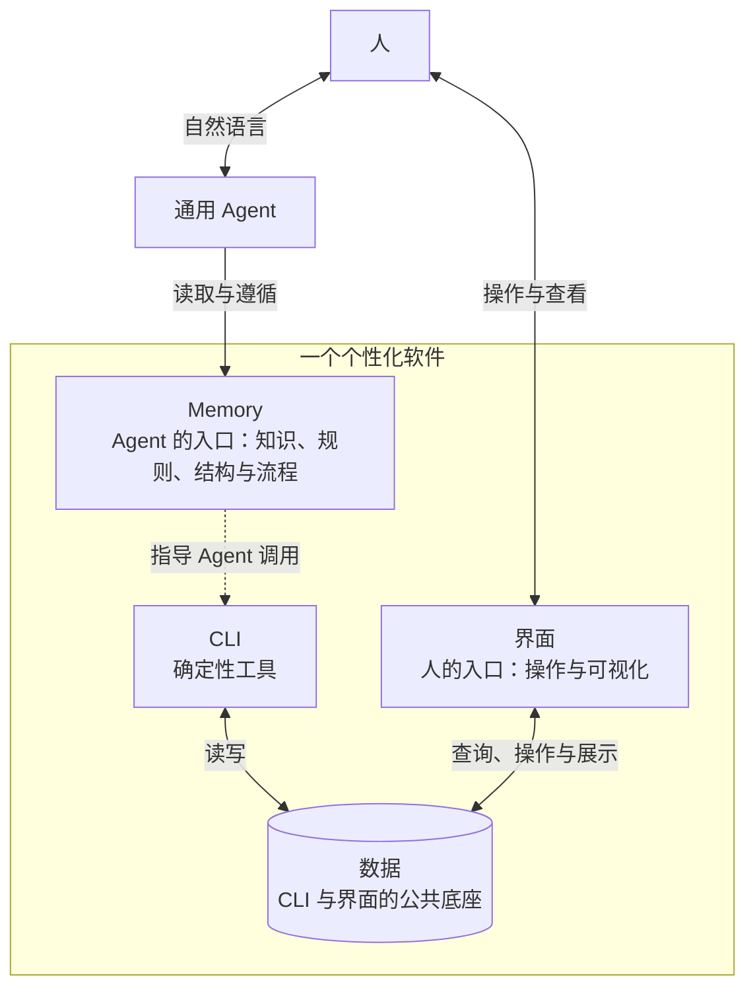

# Memsphere

简体中文 | [English](README.en.md)

> AI 时代个性化软件的运行环境

软件不再必须从代码开始。

Memsphere 让软件从自然语言开始，并在使用中逐步生长为可复用、可验证、可管理、可持续演化的个性化软件。

这里所说的个性化软件，不只面向个人。它围绕特定个人、团队、组织或行业的真实需求构建，并能随着这些需求持续演化。

Memsphere 不是另一个 Agent。它被设计为运行在不同通用 Agent 之上，为个性化软件提供一套相对稳定的语言、运行环境和资产管理方式。无论底层使用哪一种模型、哪一种 Agent，用户和组织积累下来的能力都不应被锁在一次对话或一个产品里。

## 1. 为什么会有 Memsphere

传统计算机把 CPU、GPU 等硬件能力抽象成统一的计算资源，操作系统再把这些资源组织成软件可以使用的环境。

在 AI 时代，LLM 正在成为一种新的标准算力。它擅长理解意图、处理语义、生成方案和使用工具，而使用者不必关心这些能力最终运行在 GPU、CPU、NPU 还是其他硬件上。建立在 LLM 之上的通用 Agent，则开始承担类似操作系统的角色：理解用户的目标，读取上下文，调用工具，并完成工作。

但是，有算力和 Agent 仍然不等于拥有软件。

传统软件的构建成本很高，需要专业团队把大量个体需求抽象成少数公共需求，再通过产品迭代服务尽可能多的人。那些未被抽象出来的长尾需求，通常只能依赖表格、公式、脚本和人工流程勉强解决。

LLM 改变了这种经济模型。一个人可以先用一句自然语言描述自己的工作，让 Agent 立即执行；需求发生变化时，只需修改描述；当这项工作反复出现，执行方法便可以沉淀下来。于是，软件不再必须从代码开始，它可以从自然语言开始。

问题在于，一段 Prompt 还不是可以长期依赖的软件。它通常缺少：

- 稳定的语义和规则；
- 可复用的执行流程；
- 可验证的输入、输出与中间结果；
- 持久的数据和文档；
- 确定性工具与可视化界面；
- 跨 Agent 迁移、版本管理和持续演化的机制。

Memsphere 希望补上这一层。

## 2. 从 Prompt 到 Skill，再到 Memsphere

一项个性化软件，往往从一句 Prompt 开始。它表达当前意图，让 Agent 完成一次工作。

当同类工作反复出现，执行方法可以被组织成 Skill。Skill 把指令、脚本和参考资料放在一起，使一项边界清晰的能力能够被 Agent 发现、安装和复用。[Agent Skills 开放规范](https://agentskills.io/specification)正在让这种软件形式能够在不同 Agent 之间流动。

随着需求继续生长，一项 Skill 可能需要记住长期知识、调用更多确定性工具、管理持续产生的数据、提供直接操作的界面，并记录和验证每次运行。Memsphere 为这些更丰富、更复杂的软件需求提供统一的组织方式与运行环境。

| 形态 | 适合的需求 |
| --- | --- |
| Prompt | 表达一次意图，完成当前任务 |
| Skill | 组织一项专注、边界清晰、可复用的能力 |
| Memsphere | 组织需要长期运行、持续管理和不断演化的个性化软件 |

这不是一条必须走完的路线。许多简单场景使用 Skill 已经足够，不需要变得更加复杂；当一项能力确实需要 Memory、CLI、数据和界面协同工作时，才需要由 Memsphere 承载。

Skill 与 Memsphere 也不是替代关系。在共同的 Agent 执行环境中，Skill 可以调用 Memsphere 中定义的软件，Memsphere 中的软件也可以调用 Skill 提供的能力。它们共同丰富 Agent 操作系统的软件生态。

## 3. Memsphere 位于哪里

```text
┌──────────────────────────────────────────────┐
│                 个性化软件                  │
├──────────────────────────────────────────────┤
│  Memsphere：语言、运行时与软件资产管理       │
├──────────────────────────────────────────────┤
│  通用 Agent：理解意图、规划任务、调用能力    │
├──────────────────────────────────────────────┤
│  LLM：语义计算与智能算力                     │
├──────────────────────────────────────────────┤
│  CPU / GPU / NPU / 云端及其他硬件            │
└──────────────────────────────────────────────┘
```

Agent 负责理解和执行，Memsphere 负责让软件所需的知识、规则、流程、工具、数据和界面拥有稳定的组织方式与生命周期。

这一区分很重要：Memsphere 本身不是 Agent，也不应绑定某一个 Agent。它的目标是在百花齐放的 Agent 生态中，为用户保留一层可迁移、可积累的软件资产。

## 4. 一种会生长的软件

Memsphere 规划管理四类彼此协作的资产：


```mermaid
flowchart TB
    H["人"]
    A["通用 Agent"]

    subgraph S["一个个性化软件"]
        direction TB
        M["Memory<br/>Agent 的入口：知识、规则、结构与流程"]
        C["CLI<br/>确定性工具"]
        I["界面<br/>人的入口：操作与可视化"]
        D[("数据<br/>CLI 与界面的公共底座")]

        M -.->|"指导 Agent 调用"| C
        C <-->|"读写"| D
        I <-->|"查询、操作与展示"| D
    end

    H <-->|"自然语言"| A
    A -->|"读取与遵循"| M
    H <-->|"操作与查看"| I
```

四类资产在其中承担不同的责任：

| 资产 | 作用 | 演化方式 |
| --- | --- | --- |
| Memory | 作为 Agent 进入软件的入口，保存软件理解世界、作出判断和完成工作的知识、规则、结构与流程 | 从自然语言说明生长为可读取、可验证的语义模型 |
| CLI | 封装提供给 Agent 使用的确定性工具 | 从 Agent 反复执行的步骤沉淀为代码和命令 |
| 数据 | 作为 CLI 与界面的公共底座，保存软件运行中持续产生和使用的结构化数据、文件与文档集 | 从零散上下文生长为有边界、有结构、可查询的数据资产 |
| 界面 | 作为人进入软件的入口，提供操作与可视化 | 从自然语言驱动的交互生长为稳定的操作界面和展示界面 |

这形成两个入口和一个公共底座：Agent 通过 Memory 进入软件，理解并遵循其中的知识、规则和流程，再调用 CLI 完成确定性工作；人通过界面进入软件，进行操作并查看结果。人直接交互的是界面，而不是底层数据；界面再查询、展示或修改数据。数据同时支撑 CLI 和界面，让确定性执行与人的操作始终基于同一份软件状态。

它们不要求在软件诞生的第一天就全部存在。

例如，一个个人研究助手可以先从一句话开始：“每天整理我关注领域的新论文，并说明哪些值得阅读。”随着反复使用，它会逐步形成筛选标准和研究流程，积累论文与笔记，为检索、去重和格式转换提供 CLI，最后形成用于浏览、标注和比较的界面。

在这个过程中，用户不是先设计一个完整系统再开始使用，而是在真实使用中把自然语言逐步沉淀为稳定资产。

## 5. 两种算力协同工作

LLM 的 Token 算力适合处理语义、歧义、判断和变化；传统 CPU、GPU 算力更适合确定、重复、机械化的工作。

因此，Memsphere 的一个核心方向是：

> 把 Token 留给真正需要理解和判断的部分，把已经明确的确定性工作交给 CLI。

但这种转化不应完全依赖用户自己发现和推动。Memsphere 还将提供一组内置的元记忆。它们不直接完成某项具体业务，而是指导 Agent 观察个性化软件的实际运行，识别其中反复出现、边界明确、适合确定性执行的步骤，并协助用户把这些步骤开发、验证和沉淀为个性化 CLI。

因此，两种算力的协同不是一次性的人工重构，而是软件持续演化的一部分：早期更多依赖 Token 算力探索、理解和适应需求；随着使用积累，元记忆推动 Agent 把已经稳定的部分逐步迁移到 CLI，由传统计算资源执行；Token 算力则继续用于新的、不确定的、真正需要判断的部分。

当一组步骤被沉淀成代码后，Agent 只需用更短的上下文选择并调用命令，不再每次重新推理所有细节。这样既能提高结果稳定性，也能降低 Token 消耗，并让传统计算资源重新承担它们更擅长的工作。

CLI 因而不是面向人的命令集合，而是优先面向 Agent 的软件能力层。

## 6. 快速开始

### 6.1 环境要求

- Node.js 22 或更高版本，推荐 Node 22 LTS；
- Git；
- 一个能够使用 Skill 和终端命令的 Agent。

Windows 用户需要安装 [Git for Windows](https://git-scm.com/download/win)，并确保 `git` 已加入 `PATH`。安装后请重新打开 PowerShell、CMD 或 Git Bash 等受支持 shell。运行 Memsphere 不要求先进入 Git Bash。

### 6.2 让 Agent 安装并开始教学（推荐）

Memsphere 面向 Agent 使用，安装、初始化和 Project 配置也建议直接交给 Agent 完成。请先让 Agent 进入你希望使用 Memsphere 的工作目录，然后把下面整段指令发给它：

```text
请帮我在当前工作目录安装并配置 Memsphere，全程由你执行需要的终端命令：

1. 检查 Node.js 22 或更高版本以及 Git 是否可用；如果缺少环境，清楚告诉我需要补什么。
2. 执行 npm install -g memsphere，然后执行 memsphere skill init --global。
3. 读取刚安装的 Memsphere Skill 并遵循它。若当前会话没有自动刷新 Skill 列表，请根据安装命令返回的位置直接读取 SKILL.md，继续当前任务，不要仅因此要求我新开会话。
4. 检查当前目录是否已经绑定 Project。已绑定就复用；未绑定时，询问我要使用 Managed Project 还是 Embedded Project。如果我不确定，推荐并创建 Managed Project，再绑定当前目录。
5. 执行 memsphere project show 和 memsphere validate，解决可以由你处理的安装或配置问题。
6. 安装配置成功后不要停在总结。请立即使用 memsphere，发现并完整读取“memsphere 教学流程-第一章”，启动一个有名称的 Run，并按照 Run 返回的当前步骤带我开始教学。

执行过程中，只在确实需要我选择 Project 类型、授权或完成人类步骤时暂停询问我。
```

这段指令的目标不只是“安装成功”，而是让 Agent 在同一个任务中继续启动第一章教学。教学流程开始后，Agent 会执行可以代劳的步骤，并在必须由你操作或选择时停下来说明。

### 6.3 安装命令参考

下面是 Agent 将执行的核心安装命令，也可以在排查安装问题时手动运行：

```bash
npm install -g memsphere
```

把 Memsphere Skill 安装到全局位置，使 Agent 能够发现它：

```bash
memsphere skill init --global
```

### 6.4 选择并创建 Project

Project 是 Memsphere 中保存 Memory、运行记录和其他软件资产的持久空间。把当前工作目录绑定到一个 Project 后，Agent 就能在这里读取和运行这套个性化软件。

Memsphere 提供两种 Project，最重要的区别是：Memory 要不要跟着代码仓库走。

| 类型 | Memory 放在哪里 | 修改后怎么保存 | 什么时候选择 |
| --- | --- | --- | --- |
| Managed Project | 由 Memsphere 单独保存，不放进代码仓库 | 在 Memsphere 中确认并保存 | Memory 不需要跟着代码一起提交时 |
| Embedded Project | 和代码一起放在 Git 仓库中 | 像代码一样通过 Git 提交和审查 | Memory 需要跟着代码一起协作时 |

如果暂时不确定，建议先使用 Managed Project；只有明确希望 Memory 跟随代码仓库时，再选择 Embedded Project。

#### 6.4.1 Managed Project

进入工作目录，创建并绑定一个 Managed Project：

```bash
cd <你的工程>
memsphere project create my-project --bind
```

`--bind` 只是在当前工作目录与 Project 之间建立关联，不会把 Memory 复制进工作目录。即使临时目录或 Git worktree 被删除，Project 中的 Memory 仍然存在。

创建过程中会自动安装当前版本内置的 System Memory，并通过首笔受控 ChangeSet 发布到 Managed Store。

修改 Managed Memory 时，Memsphere 会创建 ChangeSet。完成编辑后先校验，再发布：

```bash
memsphere memory edit concepts/example
memsphere memory change validate <change-id>
memsphere memory publish --change <change-id>
```

#### 6.4.2 Embedded Project

如果希望 Memory 与代码保存在同一个 Git 仓库中，创建并绑定一个 Embedded Project：

```bash
cd <你的 Git 仓库>
memsphere project create my-project --embedded .memsphere/memory --bind
```

这里的 `.memsphere/memory` 是仓库内的 Memory 目录。创建过程中会自动安装当前版本内置的 System Memory，形成留在当前 worktree 中、可由 Git 审阅的文件差异；Memsphere 不会自动 stage 或 commit。Agent 在不同 Git worktree 中工作时，会读取和修改当前 worktree 对应版本的 Memory。

修改后使用 Memsphere 校验，再通过正常的 Git 工作流提交：

```bash
memsphere memory edit concepts/example
memsphere memory change validate
git add .memsphere/memory
git commit -m "更新 Memory"
```

Embedded Memory 不使用 `memsphere memory publish`；Memsphere 不会替你提交 Git。

唯一例外是从 View 的“记忆市场”创建的 `market_import` ChangeSet：用户审阅并校验后，publish 只把隔离候选应用到当前 Embedded worktree，仍不会 commit 或 push，ChangeSet 也要等变更合入主分支后才完成。

#### 6.4.3 记忆市场

View 的 Memory 下提供“当前项目 / 记忆市场”入口。记忆市场展示随 npm 包发布的官方精选 Memory，但这些内容默认不生效，也不会进入当前 Project 的 Catalog 或 Run。点击“导入”或“重新导入”会创建市场导入 ChangeSet；同一 Project 后续逐项导入会继续追加到同一个 active ChangeSet，直到它完成或废弃。用户在 ChangeSet 中查看合并后的候选并自行决定是否发布或应用。

导入后的 Memory 是普通用户 Memory，可以自由编辑或重命名；它不会随 npm 包自动升级。View 只按当前 `<kind>/<canonical-name>` 做简单关联，并显示“未导入、导入中、已导入 · 无变更、已导入 · 有差异、名称冲突”。“导入中”表示对应的导入 ChangeSet 尚处于 active 状态，可直接跳转查看。重命名后关联自然解除；包内条目改名视为旧条目下架、新条目新增。重新导入会以包内内容替换同名 Memory，并只补入 Project 中缺失的市场依赖，不覆盖已经存在的依赖。

### 6.5 验证 Project 并启动 View

Project 的“模型”页面按包管理模型：“本项目”下有未定义包和项目包，“已导入的包”下有系统包和市场导入包，另有模型市场入口。列表展示名称、模型 ID、说明与标签，可组合包范围、标签和搜索；详情默认以“模型信息”表格展示管理属性，再查看树形模型结构或完整原始 JSON。

模型结构与管理信息分别存储。JSON Schema Draft-07 定义直接保存为可阅读的 `.json` 文件，项目模型 ID 是包含后缀的相对路径，例如 `sales/order.json`。`memsphere/model-registration.json` 定义登记信息：`modelRef`、`name`、`description`、`package`、`package_name`、`tags`、`storage`、`store_id`。持久化模型使用 `storage=store` 和 `store_id` 指向保存其结构的 DataStore，登记记录放在独立的 filesystem ValueStore 中。登记 Runtime 直接读取固定位置的定义，不依赖自己的登记记录。

`project create` 为 Managed 和 Embedded Project 自动安装五个内置模型（登记模型和四个 raw Run 模型）。原始 JSON 在发行包的 `reserved-models/system-models/`，统一由 `reserved-models/manifest.json` 管理。实际定义和登记进入所选登记目录的 `system/definitions/` 与 `system/registrations/`，所有模型 ID 都包含 `.json` 后缀，Store ID 分别为 `models/system/json-schema/draft-07` 和 `models/system/raw`。

已有 Project 显式补装内置模型并初始化登记；浏览模型不会自动写入：

```bash
memsphere --project my-project project models initialize
```

当前界面暂时隐藏“添加存储”和“初始化模型登记”入口；已有存储仍可选择和配置，相关服务与 CLI 保留供后续开放。

命令也可用 `project models initialize my-project --output json` 获取结构化回执。初始化检查当前模型、安装系统模型并补齐登记；已有与新增模型必须满足相同规则。该命令也是中断模型操作的显式恢复入口，不在浏览时自动执行。

在“设置 → 模型登记存储”先选择存储 ID，再配置该 Store 的类型和目录，登记模型固定只读。默认使用 `memsphere/model-registrations`，filesystem 目录为 `models/registrations`。已有数据时切换 ID 或目录需要明确确认迁移；目标校验成功后才切换配置，失败保留原数据，旧目录仍保留且不参与模型扫描。项目原有“模型存储”配置独立：`modelsDirectory` 默认 `models/json-schema/draft-07`，相对 Registry 登记的 Project 根目录解析，也可指定绝对路径；修改它不自动迁移模型文件。

模型市场通过同一清单管理 `reserved-models/market-models/` 中的原始 JSON，提供包含用例 01–08 的示例包 `memsphere.examples`，订单示例保留在用例 02 中，不再单列市场包。新 Project 不自动安装示例；市场移除包不会删除已导入数据，当前不提供卸载入口。导入后定义进入独立模型 DataStore，登记进入导入区域。重复导入相同内容显示无变更；已修改的内容或同模型 ID 冲突拒绝整包，并返回冲突清单，不静默覆盖。未导入和导入失败的候选不会进入正常模型列表。模型定义和数据记录可通过下方 CLI 管理；远程市场不在当前范围内。模型市场与项目写入使用相同的定义和 Runtime 校验，不保留不合规模型的使用豁免。当前示例 04/05 保留超出 Runtime 支持范围的原约束，因此八例整包导入会明确失败且不发布任何模型；不会为了导入而删减约束。

查看当前绑定的 Project，并验证其中的 Memory：

```bash
memsphere project show
memsphere validate
```

启动本地 View：

```bash
memsphere view start
```

#### 修复或升级 System Memory

现有 Managed 或 Embedded Project 如需补装、恢复或升级当前版本内置的 System Memory，可执行一次 repair。当前 manifest v4（兼容 v3）明确标记的废弃 System Memory 默认清理，但只有历史路径与 canonical identity 同时匹配时才允许删除，不会触碰用户 Memory 或 Mounted Project：

```bash
memsphere project repair my-project
# 也可使用全局选择，或省略名称采用当前 Primary Project
memsphere --project my-project project repair
```

Managed repair 内部生成受控 ChangeSet、校验完整有效 Memory 并自动发布；无差异时不创建 ChangeSet 或 Revision，ChangeSet 创建后的失败会保留为带 failure 诊断的只读 `abandoned` 记录并清理 Workspace candidate。

Embedded repair 使用命令所在 Git worktree 的有效 Memory Root。命令先拒绝覆盖计划目标上的未提交修改，在临时目录中校验完整候选 Store，再把通过校验的 System Memory 差异写回当前 worktree；不会执行 commit、push 或 Managed publish。用户使用普通 `git diff` 审阅并按仓库流程集成这些修改。linked worktree 中执行时不会修改主 worktree；无差异时不写文件。

### 6.6 发现并读取 Memory

列出当前 Project 可见的全部 Memory，或只列出 Procedure：

```bash
memsphere memory list
memsphere memory list --kind procedures
```

列表用于发现候选。确定目标后，读取完整 Memory：

```bash
memsphere memory read <reference>
```

### 6.7 运行第一个 Procedure

读取目标 Procedure 后，启动一次有名称的 Run：

```bash
memsphere run start <procedure-name> --name "<run-name>"
```

运行中的每一步都会明确要求产出 Artifact。Agent 通过 `run report` 上报结果，Memsphere 负责校验、记录状态，并在需要时进入 Review。

Review 已开始后，可以用 `memsphere run binding show/update` 或 View 调整后续评审人。当前轮和历史轮保持不变；同一 Review 的下一轮使用最后一次成功保存的 Binding。View 中保存 Binding 不要求输入设置密钥。

也可以直接在一个新的 Agent 会话中输入：

```text
请使用 memsphere，启动 memsphere 教学流程-第一章。
```

Agent 会发现并读取适用的 Procedure，创建 Run，并按照步骤推进任务。

### 6.8 模型与数据 CLI

命令使用当前 Project；可在命令前加 `--project <name>` 明确选择。所有模型 ID，包括 `memsphere/model-registration.json`、`memsphere/run/artifact.json` 和元模型 `json-schema/draft-07.json`、`raw.json`，都以 `.json` 结尾；Store ID、Factory ID 和记录 ID 不因此改名。

| 命令 | 常用参数 |
| --- | --- |
| `model list` | `--origin project\|system\|market`、`--package <id>` 或 `--unpackaged`、可重复 `--tag <tag>`、`--query <text>`、`--status available\|unavailable` |
| `model read <model-ref>` | `--part definition\|registration\|all`，默认 definition |
| `model create <model-ref>` | 必填 `--definition-file <path\|->`；可选 `--name`、`--description`、`--package`、`--package-name`、可重复 `--tag` |
| `model update <model-ref>` | 可替换 `--definition-file` 或修改上述登记字段；可重复 `--unset name\|description\|package\|package_name\|tags` 清除字段 |
| `model delete <model-ref>` | 删除未被业务 Store 使用的项目或导入模型 |
| `model validate <model-ref>` | 可选 `--definition-file <path\|->`、`--check definition\|runtime`（默认 runtime）、`--check-data`、可重复 `--store <id>` |
| `data store list / read <store-id>` | list 可用 `--model <ref>`、`--kind data\|value` 筛选直接绑定 |
| `data store create <store-id>` | 必填 `--model <ref>`、`--kind data\|value`、`--factory <id>`、`--config-file <path\|->` |
| `data store remove <store-id>` | 仅移除登记，保留数据目录和内容 |
| `data list / read <id> / has <id>` | 必填 `--store <id>`；read 可用 `--metadata-only` 或 `--path <path>` |
| `data create <id> / update <id>` | 必填 `--store <id>`，输入三选一：`--value <json>`、`--value-file <path\|->`、`--payload-file <path\|->`；Payload 还须 `--content-type <mime>` |
| `data edit <id>` | 必填 `--store <id>`，`--patch <json>` 或 `--patch-file <path\|->`；使用 RFC 6902 JSON Patch |
| `data delete <id>` | 必填 `--store <id>` |
| `data export <id>` | 必填 `--store <id>`、`--as json\|payload`、`--out <path\|->` |
| `data validate [id]` | 已存记录用 `<id> --store <id>`；候选值用 `--model <ref>` 与 `--value` 或 `--value-file` |

模型 create/update 必须通过定义、本地引用和 Runtime 检查。只允许同一模型内的 `$ref: ""`、`"#"` 或 `#/...`；跨模型和外部 URI 引用不支持。当前 JSON Schema Runtime 支持明确类型、对象字段、同类数组、本地递归及受支持的数值、长度、枚举等约束；union、条件分支、boolean 子 schema、`format` 等无法完整执行的规则会明确拒绝。不可用模型可在列表中定位问题，不能通过普通读取或只改登记绕过校验。`validate --check definition` 只是诊断，不代表模型可用。系统模型完全只读；被 Store 使用的模型允许修改登记和不改变定义内容的原文调整，但不允许修改定义语义或删除。

例如，先准备两个 UTF-8 JSON 文件：

```json
{"type":"object","properties":{"count":{"type":"integer","minimum":0}},"required":["count"]}
```

将上面的定义保存为 `counter.json`，将 `{"directory":"data/counters"}` 保存为 `store.json`，然后执行：

```sh
memsphere model create counter.json --definition-file counter.json --tag sample --output json
memsphere data store create counters --model counter.json --kind value --factory memsphere/filesystem-json --config-file store.json --output json
memsphere data create one --store counters --value '{"count":1}' --output json
memsphere data read one --store counters --path '$.count' --output json
memsphere data edit one --store counters --patch '[{"op":"replace","path":"/count","value":2}]' --expected-revision 1 --output json
memsphere data export one --store counters --as json --out one.json --output json
```

`--path <path>` 本轮使用 RFC 9535 JSONPath。传入时 `value` 始终为匹配值数组：未命中 `[]`，命中 null 为 `[null]`，命中数组不展开；省略时返回整条值。JSON Patch 的 `path/from` 使用 RFC 6901 JSON Pointer，和读取路径不同。文件参数中的 `-` 从 stdin 读取一次；JSON 输入接受 UTF-8 BOM，拒绝无效 UTF-8 或 JSON。

业务数据必须显式选择已登记的 Store，不会通过模型名猜测，也不会访问 Run、归档或系统模型存储。Store 配置中的 directory 可以是绝对路径或相对路径：绝对路径按指定位置使用，相对路径以 Registry Project 根目录解析；两者都检查存储重叠和内容兼容性。ValueStore 使用 `memsphere/filesystem-json`，记录 ID 不带物理文件后缀；DataStore 使用 `memsphere/filesystem`，ID 包含 MIME 映射后缀，Payload 输入只适用于 DataStore。`update` 是整条替换；ValueStore 的 update/edit/delete 可带 `--expected-revision` 防止覆盖旧版本，DataStore 不支持该选项和 edit。模型没有面向用户的修订号或 CAS 参数。

模型、数据和 Store 的写命令支持 `--dry-run`，只检查拟议变更；export 例外，只写显式指定的导出目标，已有目标拒绝覆盖。`--out -` 输出原始内容，与 `--output json` 回执互斥。普通读取不创建目录、修复登记或更新业务状态。文件写入通过本机跨进程锁协调，进程退出后由系统释放；锁文件可保留，不能当成过期锁删除。保护范围是通过该协议访问的本地文件系统，不承诺网络文件系统锁或外部程序直接改文件时的并发一致性；平台不支持锁时明确失败。

全部六种 `list`（model、data、data store、project、memory、archive）都支持 `--limit <n>` 和 `--cursor <token>`，默认 100，范围 1–1000。先筛选再分页；JSON/YAML 输出为 `{ "items": [...], "nextCursor": "..." }`，末页省略 nextCursor，空页为 items 空数组。继续时可改 limit，必须保持命令、Project/Store/Run、筛选条件及 Memory 父节点等查询范围。Memory 子节点保持声明顺序；Reviewer 列表继续使用 Session 绑定的 Project 与冻结 Run。

```sh
memsphere model list --origin project --limit 20 --output json
memsphere model list --origin project --limit 20 --cursor '<nextCursor>' --output json
memsphere data store list --kind value --limit 20 --output json
memsphere memory list --kind procedures --limit 20 --output json
```

新增 model/data（含 data store）命令默认 `--output text`，成功时使用 YAML 的键值、缩进和列表格式展示完整结果，保留嵌套数据及分页的 nextCursor，不是缩进 JSON。`--output json` 面向程序读取，成功的 stdout 只有一个 JSON 值；所有 list 也支持此 JSON 协议。失败时 stdout 为空，text 在 stderr 显示错误说明，json 的 stderr 只有 `{ "error": { "code": "...", "message": "...", "details": ... } }`，退出码 1。details 按需要返回；参数解析失败也遵循所选格式。原始导出正文、帮助与版本保持各自的输出规则。完整参数以各命令 `--help` 为准。

## 7. Memsphere 仍在进化

上面描述的是 Memsphere 要抵达的完整方向。我们正在从最重要的基础开始，一步步把它变成现实。

当前版本首先实现了 Memory，因为任何长期软件都需要一套可以被 Agent 准确读取和遵循的语义基础。

Memsphere 当前支持四种 Memory：

| 类型 | 回答的问题 |
| --- | --- |
| Concept | “它是什么？”——定义项目中的概念、边界和关系 |
| Statement | “什么必须成立？”——保存事实、原则、约束与规则 |
| Schema | “合格的结果长什么样？”——定义值、字段和交付契约 |
| Procedure | “这件事如何完成？”——定义可执行、可检查、可复用的流程 |

四者共同构成软件的语义部分：Concept 让 Agent 正确理解，Statement 约束决策，Schema 约束结果，Procedure 组织执行。

除此之外，当前版本还提供：

- **Project**：组织持久或随仓库维护的 Memory，并绑定当前工作目录；
- **模型与数据 CLI**：校验和管理模型、登记业务 Store，并通过明确的 ID 读写数据；
- **Run**：把 Procedure 变成一次有名称、有状态的实际运行；
- **Artifact**：保存每个步骤的交付结果，并依据 Schema 进行校验；
- **Review**：让人或 Agent 审阅运行产物；
- **ChangeSet**：安全地编辑、校验和发布 Memory 变更；
- **View**：在本地浏览 Memory、Run、Review 和变更状态；
- **Skill 接入**：让兼容的 Agent 自动发现 Memsphere，并按项目 Memory 工作。

Memsphere 仍处于早期阶段。这些能力是完整愿景的第一块地基，而不是终点。CLI、数据与界面是接下来需要逐步成为一等资产的部分。

Memsphere 将沿着同一原则继续扩展：

- 让稳定步骤能够沉淀为 Agent 专用 CLI；
- 让运行产生的数据和文档成为可管理的数据资产；
- 让需要直接人机交互的能力拥有可生成、可维护的界面；
- 让这些资产能够从自然语言开始，并在使用中逐步结构化；
- 让同一份个性化软件能够跨越不同模型与 Agent 继续运行。

我们希望最终做到的，并不是让每个人都成为传统意义上的程序员，而是让每个人、每个组织，都能拥有真正适合自己的软件。

## 8. 开发

```bash
git clone https://github.com/billtenor/memsphere.git
cd memsphere
npm install
npm run build
npm test
node scripts/model-data-smoke.mjs
```

参与开发前请阅读 [CONTRIBUTING.md](CONTRIBUTING.md)，安全问题请参阅 [SECURITY.md](SECURITY.md)。

CI 统一使用 Node 22 LTS，在 Linux、macOS 和 Windows 上运行全部自动化测试，包含原生跨进程文件锁与模型/数据 CLI 测试；Windows 安装包检查验证四种受支持 Shell 中的 CLI。模型/数据 CLI 与安装包冒烟脚本也可手动运行。

## 9. 许可证

Memsphere 使用 Apache License 2.0，详见 [LICENSE](LICENSE)。
