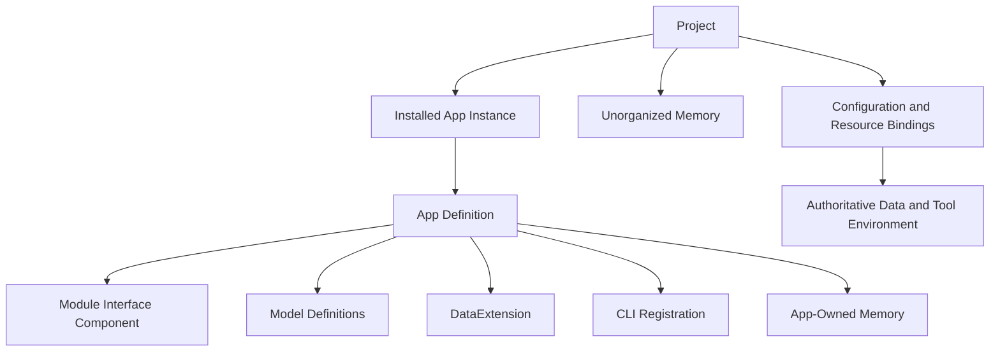
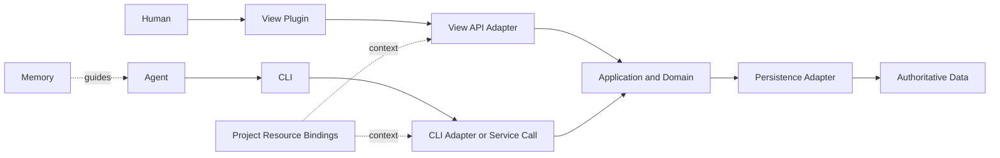

# Memsphere App Design

[简体中文](./app-design.md) | English

An App is Memsphere's unit of composition and management for a complete business capability. Memory is one of its constituent assets, delivering functionality together with interfaces, models, data extensions, and CLI capabilities. A Project is a larger undertaking that organizes this software by installing multiple Apps and also accommodates Memory that does not yet belong to any App. Humans and Agents use them through different entrypoints within the Project.

This document is a long-term design baseline alongside the [Architecture](./architecture.en.md), [Data Layer Design](./data-layer-design.md), and [View Plugin Design](./view-plugin-design.en.md). It defines the App concept, composition, runtime boundaries, and direction of evolution. The [implementation contract](./app-contract.en.md) specifies local installation, CLI registration, and business operations. Upgrade, uninstall, and asset migration remain future work.

## From Creation to Use

An author creates a distribution directory rooted at `app.json`, includes owned Memory and the required plugins and tool descriptors, and declares configuration and entrypoints. A user obtains the directory, installs it into a Project, and enables it. The installer registers the declared assets and ownership together; external CLI executables retain their own installation method. App details provide Human interface entrypoints and Agent Memory/tool entrypoints.

[Create and Install an App](./app-guide.en.md) provides a complete two-file minimal App, installation commands, expected results, and the author and user journeys for a business App. The runnable complete example is in `examples/apps/expense`.

## App Definition and Goals

**An App is an independent software unit that organizes plugins and assets around a complete business capability and declares how they collaborate.**

An App should explain the problem it solves, the entrypoints it provides, the capabilities it depends on, and how those entrypoints use the same business rules and authoritative data. Memsphere uses this information to discover, check, assemble, and manage the App. Its constituent implementations remain responsible for the business behavior.

An App's completeness is determined by its business goal. A CLI-only App is valid on its own; a procedure and the Memory it depends on can also constitute software. Models, storage, and View are added when persistent data or a Human interface becomes necessary. Empty plugins are not required for structural completeness. Existing Memory, CLIs, and extensions may also continue to be used independently without first belonging to an App.

App gives existing extension points a shared business boundary while preserving independent development and reuse of each capability. One App may reference multiple packages and external tools, and one extension may be reused by multiple Apps.

## Concept Relationships

| Concept | Responsibility and Boundary |
| --- | --- |
| App | Contains the plugins and assets needed to deliver a business capability, which may include its own Memory; declares external dependencies and collaboration relationships, and is the unit of capability composition, delivery, and management. |
| App Instance in a Project | Represents the concrete installation of an App version in a Project, recording its assets and their ownership while binding configuration, entrypoints, and required data resources. |
| Module | A View Module: an independently developed, loaded, and composed interface module providing a set of pages or a local interface, responsible for Routes, Slot contributions, interactions, and view state. |
| View Plugin | The code entrypoint through which a Module registers interface capabilities with ViewHost. |
| Package | Organizes and distributes code or assets by capability type, as a View Package or Model Package. An App may contain or depend on these packages; package and App identities and versions are not automatically equal. |
| View Package | Distributes interface capabilities such as Modules, themes, and styles. |
| Model Package | Distributes a collection of model definitions and declares required metamodel and data extension dependencies. |
| Project | A project larger than an App that installs and composes multiple Apps, retaining each App's Memory, unorganized Memory that does not yet belong to an App, Project configuration, run records, and authoritative data. |
| Memsphere Home | Provides Host-level capabilities and may store or cache release packages and components reusable across Projects; the Project records App installation and asset ownership. |

## Project and App Hierarchy

```text
Project
├── Installed App A
│   ├── Memory
│   ├── Module
│   └── Model / DataExtension / CLI and other capabilities
├── Installed App B
│   ├── Memory
│   └── Other capabilities selected for its needs
├── Unorganized Memory (not yet belonging to any App)
└── Project configuration, business data, and run records
```

A Project provides the shared project context for multiple Apps. Its Memory includes Memory belonging to installed Apps and Memory that has not yet been organized into an App. Unified discovery, reading, and governance preserve that ownership. The diagram shows a conceptual hierarchy; it does not prescribe a directory layout or require every App to contain every capability.

A Project may begin with unorganized Memory and gradually install Apps or organize memories that have developed into a complete capability into an App. Unorganized means lacking App ownership, not being unusable: these memories can still be read, edited, and executed. Bringing them into an App is an explicit asset organization operation; use by an App must not automatically change ownership.

## App Composition



The composition relationships in the diagram include App-owned assets and required extension capabilities. An App delivers its own Memory; it declares external dependencies through references. Asset ownership by an App does not require those assets to reside in one physical directory or require external tools to be copied into the App's release package.

| Component | Provides | Relationships the App Must Define |
| --- | --- | --- |
| Module | Pages, interactions, navigation, Slot contributions, and visualization. | The interface modules and business entrypoints it uses, and their dependencies. |
| Model | Structural and semantic definitions of business data. | The referenced models, definition standards, and storage bindings. |
| DataExtension | Implementations such as ModelRuntimeFactory, Serializer, DataStoreFactory, and ValueStoreFactory. | The runtime and storage capabilities it provides itself and those supplied by shared dependencies. |
| CLI Registration | Tool identity, purpose, invocation entrypoint, and usage instructions. | How the tool resolves in the current environment and obtains business context. |
| Memory | The App's own Concept, Statement, Schema, and Procedure. | Which memories ship with the App and belong to it within a Project, and which external Memory it depends on. |

Model is a definition; DataExtension implements data interpretation, processing, and storage. App reuses the existing data-layer mechanisms instead of introducing a new plugin interface for every business model.

## Memory Ownership and Unified Management

### Apps Contain and Deliver Memory

An App's Memory is part of its assets. Its deliverables should include the definitions of these memories, rather than merely requiring the Project to already contain memories with matching names. An App version should identify the Memory collection and content it delivers. Installing the App brings that Memory into the Project while preserving its ownership by the App. App upgrades also encompass the evolution of these memories.

When the same App is installed in different Projects, each Project records its own installation and usage state. The upgrade contract must define how released content and local Project changes are compared, merged, or retained. This design does not assume App Memory is read-only, nor does it permit upgrades to unconditionally overwrite Project changes.

### Ownership and References Have Distinct Roles

Memory ownership answers “which App includes this asset, or is it still unorganized Project Memory?” A logical reference answers “how can rules, procedures, or other assets find it?” Physical storage answers “where is it actually stored?” None can be inferred from the others. Distribution provenance is also distinct from ownership. A matching name, directory location, marketplace import source, or use by an App is not sufficient to claim Memory ownership.

An App may declare dependencies on Memory belonging to other Apps or on unorganized Project Memory. Cross-App references neither transfer ownership nor turn the referenced content into another owned copy. Memory requiring independent long-term maintenance may be organized into a separate App on which other Apps depend.

The existing `<kind>/<canonical-name>` logical identity and reference syntax remain in use by the current implementation. Canonical names and aliases for memories of the same kind are still checked for conflicts in the shared Catalog. Apps containing identically named memories cannot avoid conflicts by placing them in different directories or overwrite them according to loading order. A later contract will define how ownership records interact with namespaces. This design does not directly add Memory DSL fields or change logical reference formats.

### Projects Provide a Unified Usage Context

A Project brings together App Memory and unorganized Memory, providing unified entrypoints for discovery, reading, modification, validation, and procedure execution. A unified Catalog or Store is an access and governance mechanism; it does not mean all Memory within it loses App ownership and belongs independently to the Project. Concrete storage layouts and installation metadata will be designed separately.

Memory editing and installation changes reuse existing validation, ChangeSet, and publication mechanisms. The target design coordinates them with App installation and ownership records. Existing marketplace imports have no App ownership protection and cannot be treated directly as an App installer. Installation and upgrades must not take over unorganized Memory or another App's assets by matching names. Bringing unorganized Memory into an App, or explicitly retaining App Memory as unorganized content, are ownership changes that must be recorded. They must not occur implicitly through file moves or deletion of App registrations, nor implicitly rewrite existing logical identities and references.

App updates or ownership changes cannot rewrite existing Runs' frozen execution inputs, snapshots, or saved Artifacts. New Runs use the Project context effective at the time; historical Runs continue to be interpreted using the materials they saved.

## Definition and Environment Bindings

### App Definition

An App definition preserves portable composition intent and expresses at least:

- stable identity, version, name, and capability description;
- an inventory and deliverables of its own plugins and assets, including its own Memory;
- external capability and Memory dependencies, with necessary compatibility requirements;
- entrypoints for Humans and Agents;
- relationships among required configuration, models, storage, tools, and business operations.

These are semantic requirements, not finalized Manifest fields. A definition may ship with one package or reference multiple independently released packages; it does not require copying all dependencies into one repository.

### Project Bindings

During installation, the Project receives the App's assets, establishes ownership records, and binds dependencies to actual versions, configuration, Stores, and tool environments. Enablement uses these records to prepare runtime entrypoints. The definition declares what the App contains and depends on; Project installation and bindings record where it is used and with which configuration. Absolute executable paths and runtime environments on a particular machine are not intrinsic properties of the portable App definition.

The first version retains only one installed instance of a given App per Project. Installation, configuration, and data bindings are managed separately for different Projects. Multiple instances of the same App within one Project can be added when a concrete need arises. This restriction does not change the existing ability to create multiple instances of a View Module.

App identity does not automatically become a StoreId, model ID, directory name, or process isolation boundary. Private and shared storage are both expressed through explicit bindings. Shared data must use agreed business interfaces and access rules; plugin loading order cannot determine storage selection.

### Installation and Enablement

Obtaining a release package, installing an App in a Project, and enabling an App are three separate levels. Home may cache packages and shared code. Project installation records the selected version, incorporates App-owned assets, and establishes ownership. Enablement activates the installed App's entrypoints and runtime capabilities. A package's presence in Home alone does not make it part of a Project.

An external CLI may still be installed through its own installation mechanism; Memsphere only needs to retain its registration and environment bindings. Reusable code need not be copied into every Project, but that does not replace the Project's own App installation relationship or reduce App-owned Memory to an external dependency expressed only by reference.

Current View theme and Slot selections belong to Home-wide configuration, with the same composition applied to every Project. The target design must define the scope of Project App UI contributions on this basis: the shared Shell and theme retain Home configuration, while business App entrypoints follow Project enablement. App contributions must still follow Slot ownership, selection, and conflict rules and must not override an existing explicit selection. This composition rule requires a dedicated implementation; existing Home configuration cannot simply be treated as Project App configuration.

## CLI Registration

CLI registration makes a tool discoverable, understandable, and bindable as a capability. A registered tool may be an independent executable, script, existing third-party CLI, or a command-line Adapter for shared business logic. It need not load into the Memsphere process or use a common programming language or SDK, and is not part of a Module's interface contract.

| Registration Content | Purpose |
| --- | --- |
| Stable identity, name, and purpose | Allow Apps and Agents to find the required tool. |
| Logical command entrypoint and invocation instructions | Describe the command prefix, parameter usage, and help or documentation entrypoint. |
| Version or capability requirements | Determine whether the current tool meets the conditions for use. |
| Input and output conventions | Describe necessary data formats and error meanings; these may reference the tool's existing protocol, without requiring every subcommand to be modeled in the first version. |
| Runtime context requirements | Describe required working directories, Project, service addresses, configuration, or data bindings. |

CLI registration is separate from App membership. A tool may be referenced by multiple Apps or registered independently. Removing an App does not mean uninstalling the tool.

Discovery, checking, and execution are separate actions. Reading a registration returns only its description. Availability checks locate the tool and verify prerequisites using the declared method. Business execution invokes the command. Successful registration does not mean the tool is installed, business authentication is complete, or arbitrary Project data access has been granted. If version detection requires running a command, it is also an explicit check and must not execute implicitly whenever registrations are listed.

Agents may invoke tools directly after reading their registrations. A later CLI contract will determine whether Memsphere provides a unified execution entrypoint; App does not depend on such an entrypoint to be valid. Multiple Apps reference the same tool through its stable registration ID, not by injecting commands with the same name into Memsphere's top-level command tree.

## Business Invocation and Frontend–Backend Collaboration

CLI registration handles capability discovery, App bindings handle context selection, and business operation interfaces let different entrypoints execute consistent use cases. An App manifest does not implement business logic. Matching model or App IDs do not automatically connect invocation paths.



View invokes application use cases through the Host's business API. The browser does not directly access Project files, databases, or system commands. CLI may reuse the same application code locally or call the same use cases through a service interface. An independent program does not need to share a process with View.

Integrating an external CLI requires an explicit adaptation strategy. It may call an existing business service, or a server-side Adapter may invoke it as the business implementation. For a CLI-centered App, View API may translate UI operations into registered and bound CLI operations. This does not open a general browser interface for arbitrary command execution.

A shared model constrains data structure but does not replace business rules or concurrent-write contracts. CLI and View must bind to the same business instance or an agreed authoritative data source and follow its authorization, validation, write, and failure semantics. They must not maintain unrelated state and then claim to form one collaborative App.

Business APIs should expose use cases such as “record an expense” or “submit a reimbursement”; they need not reduce all functionality to generic model CRUD. Subsequent focused contracts will define interface registration, transport, context propagation, and error protocols.

## Assembly and Dependency Checks

App assembly converts Project declarations into concrete configuration that each Host can use. The normal sequence is:

1. Resolve the App definition, provided capabilities, dependencies, and versions actually used.
2. Check that the App's delivered assets and Memory ownership records are complete, and that required external components, models, Memory, and CLIs exist and are compatible.
3. Resolve Project configuration, Store bindings, and tool environment bindings; check for identity and capability conflicts.
4. Supply configuration to the corresponding mechanisms in dependency order, preparing data capabilities, business operations, CLI entrypoints, and View contributions.
5. Report App availability and failure reasons that identify the source of the problem.

App reuses existing registries and lifecycles at each layer. App ID does not replace Slot, Route, ModelRef, StoreId, Factory ID, or CLI registration ID, nor does it change their uniqueness rules. Shared dependencies resolve by their actual identities; two Apps referencing the same capability must not cause it to be registered twice.

The current DataExtensionRegistry does not accept multiple versions of the same extension ID within one Registry. Apps sharing the same Host Registry therefore cannot assume independent dependency version trees. Incompatible requirements should fail explicitly. Project configuration isolation is not in-process plugin isolation. Support for multiple versions or multiple processes is deferred until concrete needs arise.

An App must not be marked available when a required dependency is missing. Other healthy Apps and the base Shell remain operational. The first version does not introduce a generic optional-dependency degradation protocol. Checking and assembly should first produce a candidate composition. On failure, discard the candidate and clean up prepared resources according to each Host's protocol. The current data Registry cannot revoke published registrations, so updating the composition requires reconstructing the relevant Host. Residual problems should be reported when no resource cleanup protocol exists. App does not promise to roll back business writes, external installations, or data migrations that have already occurred.

## Lifecycle and Data Retention

| Operation | Boundary |
| --- | --- |
| Obtain packages or register tools | Make definitions, components, or tools discoverable and locatable; this does not yet constitute Project installation. |
| Install an App in a Project | Record its version, incorporate its own assets and Memory, and establish ownership and dependencies; installation must not implicitly execute business commands. |
| Enable | Resolve dependencies and bindings for the current Project; assemble entrypoints and runtime capabilities after checks pass. |
| Change configuration or upgrade | Include version evolution of App-owned Memory. Check local changes, dependencies, compatibility, and bindings before applying changes through the relevant Host's mechanism; do not silently overwrite Project changes or switch other Projects' versions. |
| Disable | Withdraw runtime entrypoints and use of dedicated resources while retaining the installation, App Memory ownership, business data, and run records. Do not automatically turn Memory into unorganized content or remove shared capabilities still used by other Apps. |
| Uninstall an App from a Project | Address retention or removal of App-owned assets and Memory, dependencies on them from other Apps and unorganized Memory in the Project, and local Project changes. Do not simply delete the installation record and leave ownership unclear, or delete assets unconditionally. A later uninstall contract will define retention or removal and any necessary ownership transitions. |
| Remove cached packages or shared components | Keep this separate from Project uninstallation and check installation relationships still using them; do not implicitly uninstall external CLIs or delete shared dependencies. |

App does not introduce plugin hot replacement. Changes to the composition of View or process-level data extensions follow the relevant Host's restart and reassembly mechanisms. Ordinary page mounting and unmounting remain governed by the View lifecycle.

App management does not take over the execution lifecycle of existing Runs. Restarting View or disabling an App must not be interpreted as abandoning a Run or rewriting saved Artifacts. A subsequent tool invocation that depends on a capability made unavailable by disablement should fail explicitly. The execution Host contract determines how operations already in progress finish; arbitrary external processes cannot be promised lossless interruption.

Business data migrations remain the responsibility of the relevant business and storage contracts. The App layer expresses upgrade dependencies and results. It does not provide a unified transaction across Memory, files, databases, and external services, nor does it automatically delete old data. Failures may be recovered from by correcting configuration, retrying, or restarting; the first version does not establish a generic automatic rollback system.

## Expense Management App Example

An expense management App provides Humans with entrypoints for everyday expense recording and viewing, and Agents with batch entry and reimbursement procedures.

| Component or Binding | Example |
| --- | --- |
| Module | An interface module providing expense lists, entry forms, and reimbursement status pages. |
| Model | Expense record and reimbursement claim definitions. |
| DataExtension | Reuse existing model Runtimes and storage Factories; develop no new extension without a specific need. |
| CLI | An independently released `expense` tool, with its help entrypoint, availability requirements, and business context registered. |
| Memory | Expense classification rules and a reimbursement Procedure delivered with the App, belonging to the expense management App within the Project after installation. |
| Project Binding | The service or Store for the current ledger, configuration, and the tool's local location. |

When a Human records an expense through the form, View API invokes the expense-recording use case. When an Agent follows the reimbursement Procedure, it invokes the same use case through CLI. Both paths use the same ledger and validation rules, and newly added records are visible in both the UI and subsequent CLI queries.

A team Project may install both an expense management App and a procurement App, each owning its own procedures and rules, while temporary team conventions remain unorganized Memory. The Project's Memory entrypoint can discover all this content and show its ownership. When the team decides to bring a convention into the expense management App, it should perform an explicit organization operation. A procurement procedure referencing that convention does not acquire another ownership claim.

Installing the same App in another Project reuses its release content while separately recording installation, Memory ownership, ledger, and configuration. If `expense` is unavailable in the tool environment bound by that Project, the App's delivered Memory is missing, or external Memory dependencies are unmet, check results should identify the specific missing items. After disablement, App Memory still belongs to that App, and expense records and reimbursement Runs remain. Uninstallation then handles current Memory according to the asset disposition contract, while historical Run materials remain unchanged.

## Current Implementation and Future Scope

One complete iteration provides local App installation, configuration, checks, enablement, Memory ownership, CLI registration and binding, Project View/Model composition, and bidirectional CLI/View operations in the expense App.

See the [implementation contract](./app-contract.en.md) for fields, persistence, runtime boundaries, and diagnostics. Entry points are `src/app/`, `src/tools/registry.ts`, and `src/commands/app.ts`, integrated with existing Memory, Run, Model Host, and View Runtime facilities.

Future work includes remote distribution, upgrades and local-change merging, uninstall disposition, adopting or releasing existing Memory, and multiple installations of one App within a Project. The first version does not provide CLI hosting, a process execution gateway, hot replacement, cross-system transactions, or a sandbox for untrusted code.
