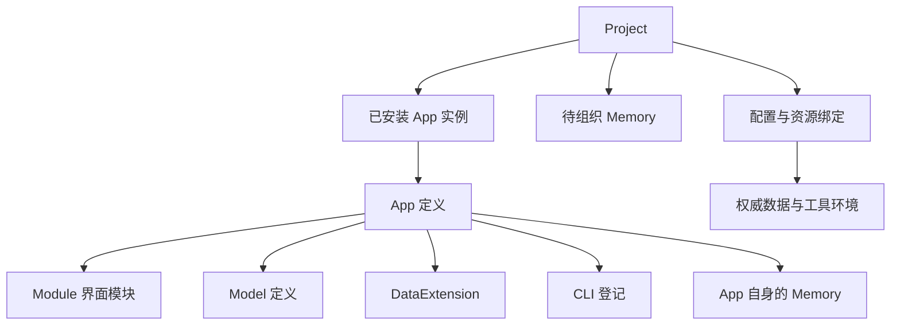
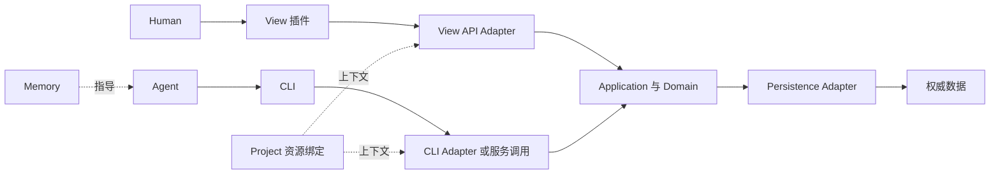

# Memsphere App 整体设计

简体中文 | [English](./app-design.en.md)

App 是 Memsphere 面向完整业务功能的组合与管理单元，Memory 是其中的一类组成资产，与界面、模型、数据扩展和 CLI 能力共同交付功能。Project 是更大的项目，通过安装多个 App 组织这些软件，同时容纳尚未归入任何 App 的 Memory。Human 与 Agent 在 Project 中通过不同入口使用它们。

本文是与[总体架构](./architecture.md)、[数据层设计](./data-layer-design.md)和 [View 插件设计](./view-plugin-design.md)并列的长期设计基线。它规定 App 的概念、组成、运行边界和演进方向；当前本地安装、CLI 登记与业务操作接口由[实现契约](./app-contract.md)细化；升级、卸载和资产迁移仍属于后续范围。

## 从创建到使用

作者创建一个以 `app.json` 为入口的发行目录，放入自有 Memory 和所需插件、工具描述，声明配置和使用入口；使用者取得目录，在目标 Project 中安装并启用。安装器统一登记清单内的资产和归属，外部 CLI 程序按自身方式安装。安装完成后，App 详情直接给出 Human 的界面入口和 Agent 的 Memory/工具入口。

[创建和安装 App](./app-guide.md) 给出两个文件构成的最小 App、安装命令、预期结果，以及完整业务 App 的作者和使用者操作路径。可运行的完整示例位于 `examples/apps/expense`。

## App 的定义与目标

**App 是围绕一个完整业务功能，将若干插件与资产组织起来，并声明它们如何协作的独立软件单元。**

一个 App 应能说明它解决什么问题、提供哪些入口、依赖哪些能力，以及这些入口如何使用同一套业务规则和权威数据。Memsphere 据此发现、检查、装配和管理 App；具体业务仍由组成它的实现负责。

App 的完整性由业务目标决定。仅提供 CLI 的 App 可以独立成立；一份流程及其依赖的 Memory 也可以构成软件。需要持久数据或人工界面时，再逐步引入模型、存储和 View，不要求为了形式完整创建空插件。既有 Memory、CLI 和扩展也可以继续独立使用，不必先归入 App。

App 让已有扩展点拥有共同的业务边界，同时保留各类能力的独立开发和复用方式。一个 App 可以引用多个包和外部工具；一个扩展也可以被多个 App 复用。

## 概念关系

| 概念 | 职责与边界 |
| --- | --- |
| App | 包含完成业务功能所需的插件与资产，其中可以包含自身的 Memory；声明外部依赖与协作关系，是功能组合与交付管理单位。 |
| Project 中的 App 实例 | 表示一个 App 版本在 Project 中的具体安装，记录包含的资产及其归属，并绑定配置、入口与所需数据资源。 |
| Module | 即 View Module，可独立开发、加载和组合的界面模块，提供一组页面或局部界面，负责路由、Slot 贡献、交互与视图状态。 |
| View Plugin | Module 向 ViewHost 注册界面能力的代码入口。 |
| Package | 按能力类型组织和分发代码或资产的包，分为 View Package 和 Model Package；App 可以包含或依赖这些包，包与 App 的身份和版本不自动相等。 |
| View Package | 承载 Module、主题、样式等界面能力的分发包。 |
| Model Package | 承载一组模型定义，并声明所需元模型和数据扩展依赖的分发包。 |
| Project | 比 App 更大的项目，安装并组合多个 App，保存各 App 的 Memory、尚未归属 App 的待组织 Memory、项目配置、运行记录和权威数据。 |
| Memsphere Home | 提供宿主级能力，可保存或缓存供多个 Project 复用的发行包与组件；App 的项目安装与资产归属由 Project 记录。 |

## Project 与 App 的层级

```text
Project
├── 已安装 App A
│   ├── Memory
│   ├── Module
│   └── Model / DataExtension / CLI 等组成能力
├── 已安装 App B
│   ├── Memory
│   └── 按功能需要选择的其他组成能力
├── 待组织 Memory（尚不属于任何 App）
└── 项目配置、业务数据与运行记录
```

Project 提供多个 App 共同使用的项目上下文。Project 的 Memory 包括各已安装 App 所属的 Memory，以及尚未归入 App 的 Memory；统一发现、读取和治理这些内容，不抹去它们的归属。上图表示概念层级，不规定目录结构或要求每个 App 都包含所有能力。

Project 可以先从待组织 Memory 开始，随后逐步安装 App，或把已经形成完整功能的记忆组织成 App。待组织表示尚无 App 归属，不表示不可使用；它们仍可以被读取、编辑和执行。将其纳入 App 是明确的资产组织操作，不能因为被某个 App 调用就自动改变归属。

## App 的组成



图中的组成关系包括 App 自有资产及所需扩展能力。App 自身的 Memory 随 App 交付；外部依赖通过引用声明。资产属于 App 不要求它们位于同一个物理目录，也不要求把外部工具复制进 App 的发行包。

| 组成 | 提供的内容 | App 需要明确的关系 |
| --- | --- | --- |
| Module | 页面、交互、导航、Slot 贡献和可视化。 | 使用哪些界面模块、业务入口及其依赖。 |
| Model | 业务数据的结构与语义定义。 | 引用哪些模型、定义标准及其存储绑定。 |
| DataExtension | ModelRuntimeFactory、Serializer、DataStoreFactory 和 ValueStoreFactory 等实现。 | 哪些运行和存储能力由自身提供，哪些来自共享依赖。 |
| CLI 登记 | 工具身份、用途、调用入口和使用说明。 | 工具如何解析到当前环境，以及如何取得业务上下文。 |
| Memory | App 自身的 Concept、Statement、Schema 和 Procedure。 | 哪些记忆随 App 交付、在 Project 中属于该 App，以及依赖哪些外部 Memory。 |

Model 是定义，DataExtension 是解释、处理和存储数据的实现。App 复用数据层已有机制，不为每个业务模型创建一套新的插件接口。

## Memory 归属与统一管理

### App 包含与交付 Memory

App 的 Memory 是其组成资产，App 的交付内容应包含这些记忆的定义，而不只是要求 Project 事先存在若干同名记忆。App 版本应能够标识其交付的 Memory 集合与内容；安装 App 时，这些 Memory 随之进入 Project，并保留属于该 App 的关系。App 的升级范围也包括这些记忆的演进。

同一 App 安装到不同 Project 时，各项目分别记录自己的安装及使用状态。发布版本和项目中的本地修改如何比较、合并或保留，需要在升级契约中明确；本设计不预设 App Memory 只读，也不允许把升级解释为无条件覆盖项目修改。

### 归属与引用各司其职

Memory 的归属回答“它是哪个 App 的组成资产，还是尚未组织的项目记忆”；逻辑引用回答“规则、流程或其他资产如何找到它”；物理存储回答“它实际保存在哪里”。三者不能互相推导。发行来源也不等于归属，不能仅因同名、目录位置、市场导入来源或某个 App 的使用而认领 Memory。

App 可以声明对其他 App 所属 Memory 或项目待组织 Memory 的依赖。跨 App 引用不转移归属，也不把被引用内容变成第二份自有资产。复用需要长期独立维护的记忆时，可以把它组织为独立 App，再由其他 App 依赖。

现有 `<kind>/<canonical-name>` 逻辑身份及引用语法继续用于当前实现，同类型记忆的规范名称和别名仍在共同 Catalog 中检查冲突。不同 App 包含同名记忆时，不能依靠不同目录避开冲突，也不能按加载顺序覆盖。归属记录与命名空间如何结合由后续契约明确；本设计不直接新增 Memory DSL 字段或改变逻辑引用格式。

### Project 提供统一使用上下文

Project 汇集 App Memory 与待组织 Memory，提供统一的发现、读取、修改、校验和流程执行入口。统一 Catalog 或 Store 是访问与治理机制，不意味着其内所有 Memory 都脱离 App 独立归属 Project；具体存储布局与安装元数据另行设计。

Memory 的编辑与安装变更复用已有校验、ChangeSet 和发布机制，并在目标设计中结合 App 安装与归属记录协调。既有市场导入没有 App 归属保护，不能直接视为 App 安装器；安装或升级不得按同名接管待组织 Memory 或其他 App 的资产。将待组织 Memory 纳入 App、将 App Memory 明确保留为待组织内容，都是需要记录的归属变更，不由文件移动或删除 App 登记隐式完成，也不隐式改写原有逻辑身份和引用。

App 更新或归属变化不能改写既有 Run 已冻结的运行输入、快照与已保存的 Artifact。新运行使用当时有效的项目上下文，历史运行继续按自身保存的材料解释。

## 定义与环境绑定

### App 定义

App 定义保存可迁移的组合意图，至少表达以下信息：

- 稳定身份、版本、名称和功能说明；
- 自有插件与资产的清单和交付内容，包括自身的 Memory；
- 外部能力与 Memory 依赖，以及必要的兼容要求；
- 面向 Human 和 Agent 的使用入口；
- 所需配置、模型、存储、工具及业务操作之间的关系。

这些是语义要求，不是已经确定的 Manifest 字段。定义可以随一个包分发，也可以引用多个独立发布的包；不要求把所有依赖复制进一个仓库。

### Project 绑定

安装时，Project 接收 App 交付的资产、建立归属记录，并把依赖绑定到实际版本、配置、Store 和工具环境；启用时据此准备运行入口。定义声明包含什么、依赖什么，项目安装与绑定记录当前在哪里、以什么配置使用。机器上的可执行文件绝对路径和运行环境不写成可移植 App 定义的固有属性。

首版每个 Project 对同一 App 只保留一份安装实例。不同 Project 的安装、配置和数据绑定分别管理；以后有实际需要时，再扩展同一 Project 内的多 App 实例。这一限制不改变现有 View Module 可创建多个实例的机制。

App 身份不自动成为 StoreId、模型 ID、目录名或进程隔离边界。私有存储与共享存储均通过显式绑定表达；共享数据必须使用约定的业务接口和访问规则，不能依靠插件加载顺序选择存储。

### 安装与启用

取得发行包、在 Project 安装 App、启用 App 是三个层次。Home 可以缓存包和共享代码；Project 安装记录所选版本、纳入 App 自有资产并建立归属；启用使已安装 App 的入口和运行能力生效。仅在 Home 有一个包不代表它已经属于某个 Project。

外部 CLI 仍可由自己的安装方式提供，Memsphere 保存登记和环境绑定即可。可复用代码不必复制进每个 Project，但这不替代项目自己的 App 安装关系，也不把 App 自有 Memory 降为只有引用的外部依赖。

当前 View 的主题与 Slot 选择属于 Home 全局配置，同一组合应用到所有 Project。目标设计需要在此基础上明确 Project App 的界面贡献范围：公共外壳与主题沿用 Home 配置，业务 App 的入口随 Project 启用。App 的贡献仍须经过 Slot 所有权、选择与冲突规则，不得覆盖已有明确选择。这一组合规则需要专项实现，不能把现有 Home 配置直接当作 Project App 配置。

## CLI 登记

CLI 登记使工具成为可发现、可理解、可绑定的能力。被登记的工具可以是独立可执行程序、脚本、已有第三方 CLI，或共享业务实现的命令行 Adapter；不要求加载进 Memsphere 进程，不要求采用同一种编程语言或 SDK，也不属于 Module 的界面契约。

| 登记内容 | 目的 |
| --- | --- |
| 稳定身份、名称与用途 | 让 App 和 Agent 找到所需工具。 |
| 逻辑命令入口与调用说明 | 说明命令前缀、参数使用方式及帮助或文档入口。 |
| 版本或能力要求 | 判断当前工具是否满足使用条件。 |
| 输入输出约定 | 说明必要的数据格式和错误含义；可引用工具已有协议，不要求首版重新建模全部子命令。 |
| 运行上下文要求 | 说明需要的工作目录、Project、服务地址、配置或数据绑定。 |

CLI 登记与 App 归属分开。一个工具可以被多个 App 引用，也可以单独登记；移除某个 App 不等于卸载该工具。

发现、检查和执行是三个独立动作。读取登记只返回描述；可用性检查按已声明的方式定位工具并检查必要条件；业务执行才调用命令。登记成功不意味着工具已安装、业务认证已完成或获得任意 Project 数据访问能力。版本探测如果需要运行命令，也属于显式检查，不能在每次列举登记时隐式执行。

Agent 可以读取登记后直接调用工具。是否提供 Memsphere 统一执行入口由后续 CLI 契约决定，App 不以该入口为成立前提。多个 App 通过稳定登记 ID 引用同一工具，不通过向 Memsphere 顶层命令树注入同名命令来建立身份。

## 业务调用与前后端协作

CLI 登记解决能力发现，App 绑定解决上下文选择，业务操作接口负责让不同入口执行一致的用例。App 清单本身不实现业务逻辑，也不因模型或 App ID 相同就自动打通调用。



View 通过宿主的业务 API 调用应用用例，浏览器不直接访问项目文件、数据库或系统命令。CLI 可以在本地复用相同的应用代码，也可以通过服务接口调用同一组用例；独立程序不必与 View 共用进程。

外部 CLI 接入时需要明确适配方式。它可以调用已有业务服务，也可以作为业务实现由服务端 Adapter 调用。对于以 CLI 为核心的 App，View API 可以把界面操作转换成已登记、已绑定的 CLI 操作。宿主不因此开放执行任意命令的通用浏览器接口。

同一份模型只约束数据结构，不能代替业务规则和并发写入契约。CLI 与 View 必须绑定同一业务实例或约定的权威数据来源，并遵守其权限、校验、写入和失败语义。不得让两端各自维护互不关联的状态，再宣称属于同一个可协作 App。

业务 API 应面向“录入费用”“提交报销”等用例，不要求把所有功能压成模型通用 CRUD。接口的注册、传输、上下文传递与错误协议由后续专项契约定义。

## 装配与依赖检查

App 装配将 Project 声明转换成各宿主能够使用的具体配置，正常顺序为：

1. 解析 App 定义、提供项、依赖和实际使用的版本。
2. 检查 App 交付资产及 Memory 归属是否完整，所需外部组件、模型、Memory 与 CLI 是否存在且兼容。
3. 解析 Project 配置、Store 及工具环境绑定，检查身份和能力冲突。
4. 按依赖顺序向对应机制提供配置，准备数据能力、业务操作、CLI 入口和 View 贡献。
5. 对外报告 App 的可用性和可定位的失败原因。

App 复用各层已有注册表和生命周期。App ID 不替代 Slot、Route、ModelRef、StoreId、Factory ID 或 CLI 登记 ID，也不改变它们的唯一性规则。共享依赖由实际身份解析，不能因两个 App 都引用它就重复注册同一能力。

当前 DataExtensionRegistry 在同一 Registry 中不接受同一扩展 ID 的多个版本。因此，共享同一宿主 Registry 的 App 不能假定各自拥有互不影响的依赖版本树。存在不兼容要求时应明确失败；Project 配置隔离不等于进程内插件隔离。多版本并存或多进程隔离留待出现实际需求后设计。

必需依赖缺失时不能把 App 标为可用；其他健康 App 和基础 Shell 继续工作。首版不引入通用的可选依赖降级协议。检查和装配应先形成候选组合，失败时丢弃候选，按各宿主协议清理已准备的资源。当前数据注册表不提供撤销已发布注册的能力，更新组合需要重建相关宿主；没有资源清理协议时应报告残留问题。App 不承诺回滚已经发生的业务写入、外部安装或数据迁移。

## 生命周期与数据保留

| 操作 | 边界 |
| --- | --- |
| 获取包或登记工具 | 使定义、组件或工具可发现、可定位；尚不构成 Project 安装。 |
| 在 Project 安装 App | 记录版本、纳入自有资产和 Memory、建立归属与依赖关系；不因安装而隐式执行业务命令。 |
| 启用 | 解析当前 Project 的依赖与绑定，完成检查后装配入口和运行能力。 |
| 修改配置或升级 | 包括 App 自有 Memory 的版本演进，检查本地修改、依赖、兼容性和绑定后按相关宿主方式生效；不静默覆盖项目修改或切换其他 Project 的版本。 |
| 停用 | 撤销运行入口和专属资源使用，保留安装、App Memory 的归属、业务数据与运行记录；不把 Memory 自动变成待组织内容，不移除其他 App 仍使用的共享能力。 |
| 从 Project 卸载 App | 处理 App 自有资产及 Memory 的去留、Project 内其他 App 与待组织 Memory 对它们的依赖，以及项目本地修改；不能只删除安装记录而留下不明归属，也不能无条件删除。保留还是移除及必要的归属转换由后续卸载契约明确。 |
| 移除缓存包或共享组件 | 与 Project 卸载分开，检查仍在使用它的安装关系；不连带卸载外部 CLI 或删除共享依赖。 |

App 不引入插件热替换。需要改变 View 或进程级数据扩展组合时，沿用相关宿主重启和重新装配的方式；普通页面挂载与卸载仍由 View 生命周期管理。

App 管理不接管现有 Run 的执行生命周期。View 重启和 App 停用不能被解释为废弃 Run，也不能改写已保存的 Artifact；停用后尚未发生的工具调用如果依赖已不可用的能力，应明确失败。正在执行的业务操作如何收尾由执行宿主契约规定，不能承诺任意外部进程可被无损中止。

业务数据迁移由所属业务和存储契约负责。App 层负责表达升级依赖与结果，不提供跨 Memory、文件、数据库和外部服务的统一事务，也不自动删除旧数据。失败可以通过修正配置、重试或重启恢复，不为首版建立通用自动回滚系统。

## 费用管理 App 示例

费用管理 App 为 Human 提供日常录入与查看入口，为 Agent 提供批量录入和报销流程。

| 组成或绑定 | 示例 |
| --- | --- |
| Module | 提供费用列表、录入表单和报销状态页面的界面模块。 |
| Model | 费用记录和报销单定义。 |
| DataExtension | 复用已有模型 Runtime 与存储 Factory；没有特殊需要时不开发新扩展。 |
| CLI | 独立发布的 `expense` 工具，登记其帮助入口、可用性要求和业务上下文。 |
| Memory | 随 App 交付的费用分类规则与报销 Procedure，安装后在 Project 中归属费用管理 App。 |
| Project 绑定 | 当前账本的服务或 Store、配置，以及本机工具位置。 |

Human 在表单中录入费用时，View API 调用费用录入用例。Agent 遵循报销 Procedure 时，通过 CLI 调用同一用例。两条路径使用相同账本与校验规则，新增记录都能在页面和后续 CLI 查询中看到。

一个团队 Project 可以同时安装费用管理 App 和采购 App，分别拥有各自的流程与规则；临时记录的团队约定仍可作为待组织 Memory。Project 的记忆入口能够统一发现这些内容，并显示它们的归属。团队决定把某条约定纳入费用管理 App 时，应执行明确的组织操作；采购流程引用该约定不会再取得一份归属。

将同一 App 安装到另一个 Project 时，复用发行内容，但单独记录安装、Memory 归属、账本与配置。若该 Project 绑定的工具环境中 `expense` 不可用，或 App 交付的 Memory 缺失、外部记忆依赖未满足，检查结果应指出具体缺项。停用后 App Memory 仍属于该 App，费用记录和报销 Run 也保留；卸载时再按资产处置契约处理当前记忆，历史运行材料保持不变。

## 当前实现与后续范围

当前实现以一次完整功能迭代交付本地 App 安装、配置、检查、启停、Memory 归属、CLI 登记与绑定、Project View/Model 装配，以及费用 App 的 CLI/View 双向业务操作。

具体字段、存储、运行边界和诊断见[实现契约](./app-contract.md)。核心入口是 `src/app/`、`src/tools/registry.ts`、`src/commands/app.ts`，并接入现有 Memory、Run、Model Host 和 View Runtime。

后续按实际需求建设远端分发、升级与本地修改合并、卸载资产处置、已有 Memory 纳入/转出及同一 Project 内多安装实例。首版不建设通用 CLI 托管平台、进程执行网关、热替换、跨系统事务或非可信代码沙箱。
